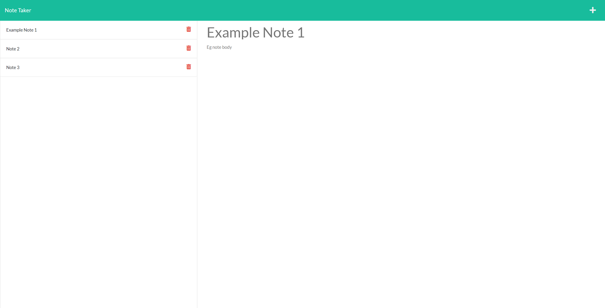

# Note Taker


## Description

    An application that can be used to write and save notes.

## Built With

      - HTML
      - CSS
      - JS
      - Node
      - Express.js

| Table of Contents                 |
| --------------------------------- |
| [I Installation.](#installation)  |
| [II Usage.](#usage)               |
| [III License.](#licenses)         |
| [IV Contributing.](#contributing) |
| [V Tests.](#tests)                |
| [VI Questions.](#questions)       |

## Installation

Clone the repo

```
git clone https://github.com/Wratten/Note-Taker.git
```

Install dependencies

```
npm install
```

## Usage

This app can be used to take notes and save them, so you can remember important information!

To run this app,

```
node server.js
```



## Contributions

    Contributions are what make the open source community such an amazing place to learn, inspire, and create. Any contributions you make are greatly appreciated.

    If you have a suggestion that would make this better, please fork the repo and create a pull request. Thanks again!

## Tests

     No tests have been developed for this app.

## License

      This project is using the MIT license.

## Questions

If you have any questions about this repo please feel free to reach out to me through [GitHub](https://github.com/Wratten) or [Email](mailto:daniel.wratten@gmail.com)
